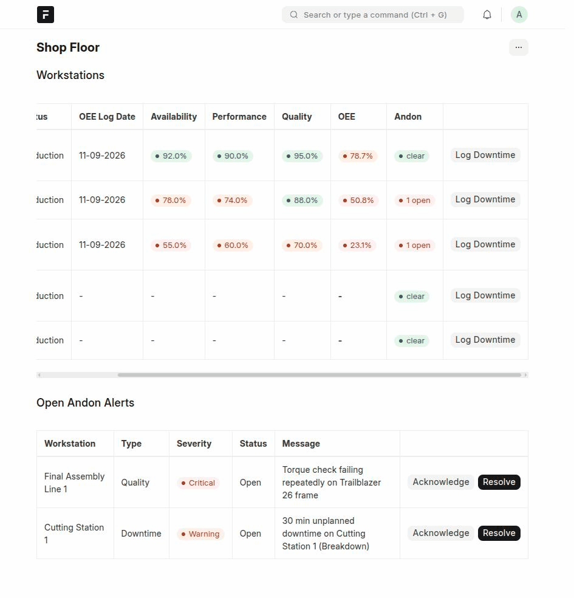
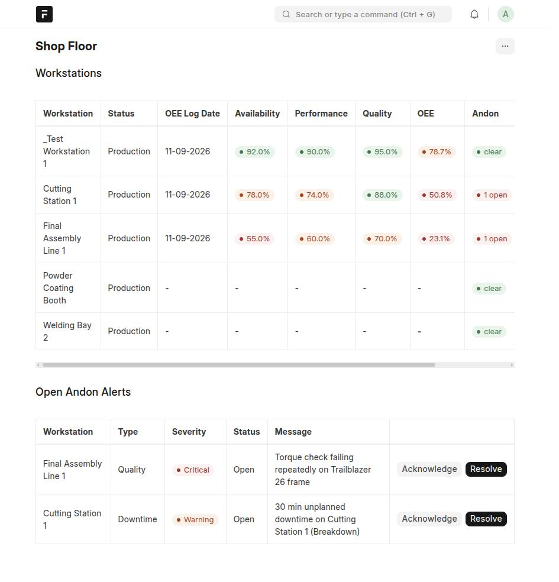
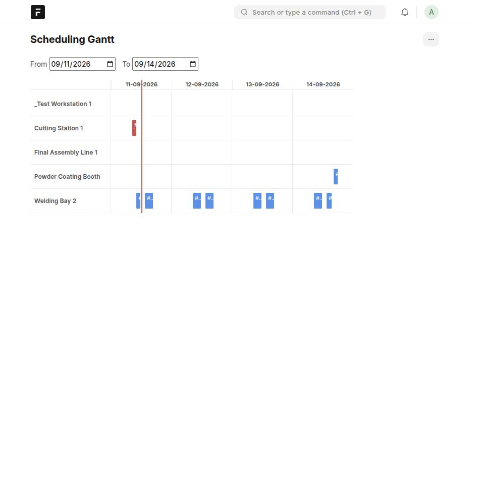
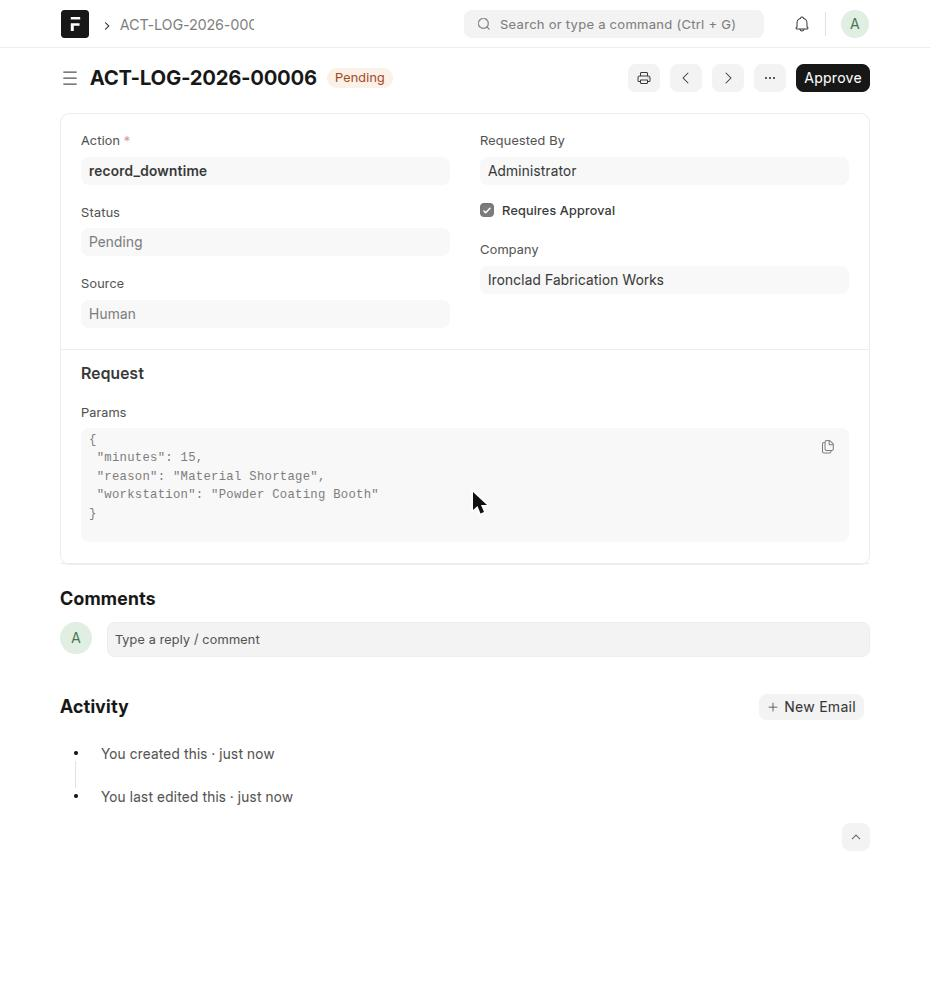

### Floorgraph

A governed action-graph MES (Manufacturing Execution System) layer for ERPNext - shop-floor execution, OEE, finite-capacity scheduling, and IoT/agent event ingestion, all routed through one auditable, approval-gated action layer that humans, sensors, and rule-based agents share.

### Why this exists

ERPNext's manufacturing module tracks Work Orders, Job Cards, and BOMs, but has no live shop-floor picture: no OEE, no downtime taxonomy tied to availability math, no finite-capacity scheduling, and no governed way for a sensor or an automated rule to request a change without a human silently losing visibility into who (or what) asked for it.

This isn't a guess at demand - [`frappe/erpnext#50827`](https://github.com/frappe/erpnext/issues/50827) asked ERPNext's maintainers for exactly this (real-time machine monitoring, downtime tracking, OEE, PLC/IoT integration). It was closed with the core team's own assessment: *"this calls for a product in itself, just like what Frappe CRM is to ERPNext."* Floorgraph is that product - a standalone app, not a PR into ERPNext core.

**How it's different from ERPNext's own "Plant Floor" (v15+):** Plant Floor is a real-time visual dashboard of machine/workstation status - genuinely useful, and floorgraph doesn't duplicate it. But it has no OEE calculation, no downtime tracking, and no approval/governance workflow. Floorgraph adds all three, and its `Downtime Reason`/`Downtime Log` doctypes exist alongside ERPNext's native `Downtime Entry` rather than replacing it - that native doctype has no Planned/Unplanned split and requires a mandatory Employee link, neither of which fits floorgraph's OEE math or its User-driven action model.

### The governed action layer

The one idea worth calling out: every write to the shop floor - a human clicking Approve, a sensor's webhook event, a scheduled rule firing - goes through the same `Action` → `Action Log` pipeline (`floorgraph.actions.engine`), never a shortcut. `source` (`Human` / `Sensor` / `Agent`) is hardcoded per calling surface, not caller-supplied, so an HTTP request can't spoof it. Agent-sourced requests always require human approval, enforced in code rather than as a configurable flag, so it can't be silently weakened by editing an Action record in Desk. Every request, approval, rejection, and execution is one audited `Action Log` row.

### What's built

- **Governed action layer** - `Action` / `Action Allowed Role` / `Action Log` doctypes, deny-by-default permissions, approve/reject with row locking.
- **Shop-floor execution** - `Downtime Reason` / `Downtime Log`, a background OEE job (Availability × Performance × Quality per workstation per day), `Andon Alert` with live push, a real-time shop-floor dashboard (`/app/shop-floor`).
- **Finite-capacity scheduler** - `Changeover Rule`, greedy forward/backward placement respecting working hours and changeover time, audited `Scheduling Run` with rollback, a native (no external library) drag-to-reschedule Gantt page (`/app/schedule-gantt`) where every drag is itself a governed action.
- **Agent + IoT** - `Machine Event Source` / `Machine Event Log` behind a generic authenticated webhook (HMAC-SHA256 over the raw request body, per-source allowlist - devices have no Frappe session, so this is the trust boundary, not `allow_guest`). `Agent Rule` evaluates structured conditions (doctype + field + operator + threshold, no eval of arbitrary code) on an hourly schedule and requests governed actions that always land pending approval. The approval inbox has one-click filters for Human/Sensor/Agent-sourced requests.

The webhook is plain HTTP today, not MQTT/OPC-UA - deliberately: it's the simplest thing that gets the governance model right end-to-end, and real PLC/gateway integration is better served by a small bridge that forwards into this same webhook than by baking a broker dependency into the app itself. Worth revisiting if a real deployment needs it.

71 tests, full suite green, CI passing against Frappe/ERPNext v15 and v16 (a real two-leg matrix, not a single pinned version).

### Screenshots

A downtime request going through the full governed flow - logged from the shop floor, approved, then a Gantt reassignment requested the same way:



**Shop floor dashboard** (`/app/shop-floor`) - live OEE per workstation with color thresholds, open Andon alerts, one-click downtime logging:



**Scheduling Gantt** (`/app/schedule-gantt`) - drag-to-reschedule, a "now" marker, and overdue slots (red) flagged automatically from each Job Card's own status:



**Approval inbox** - every request lands here first; Approve is the primary action, not buried in a menu:



### Installation

You can install this app using the [bench](https://github.com/frappe/bench) CLI. Requires ERPNext (`required_apps` in `hooks.py`).

```bash
cd $PATH_TO_YOUR_BENCH
bench get-app $URL_OF_THIS_REPO --branch main
bench install-app floorgraph
```

To try it with realistic sample data (a Company, BOM, Work Order, and Job Cards) instead of starting from an empty site:

```bash
bench --site $SITE execute floorgraph.setup.demo_manufacturing.create_demo_manufacturing_data
```

### Contributing

`main` is the stable branch installs should target; `develop` is where active work lands before a release. Open PRs against `develop`.

This app uses `pre-commit` for code formatting and linting. Please [install pre-commit](https://pre-commit.com/#installation) and enable it for this repository:

```bash
cd apps/floorgraph
pre-commit install
```

Pre-commit is configured to use the following tools for checking and formatting your code:

- ruff
- eslint
- prettier
- pyupgrade

Run the test suite with:

```bash
bench --site $SITE run-tests --app floorgraph
```

### CI

This app can use GitHub Actions for CI. The following workflows are configured:

- CI: Installs this app and runs unit tests on every push to `develop` branch.
- Linters: Runs [Frappe Semgrep Rules](https://github.com/frappe/semgrep-rules) and [pip-audit](https://pypi.org/project/pip-audit/) on every pull request.


### License

mit
